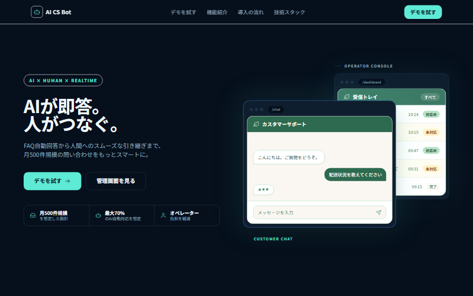
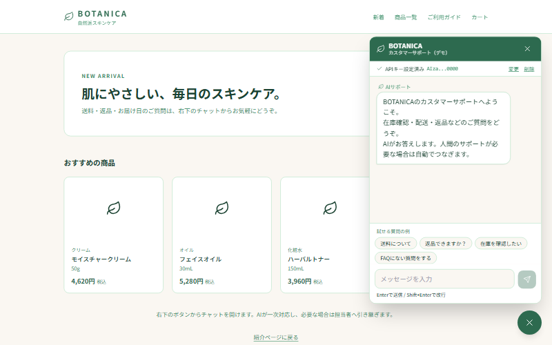
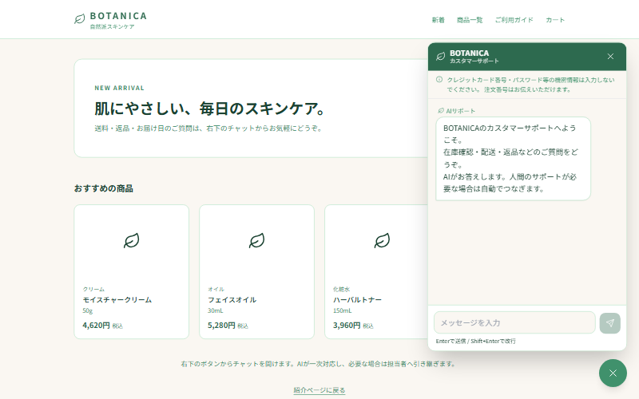
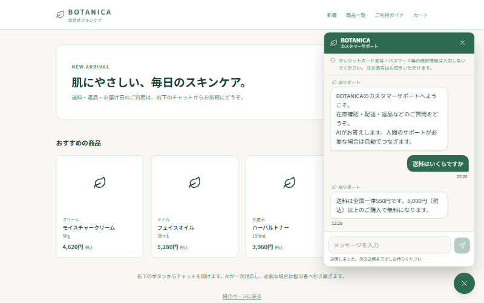
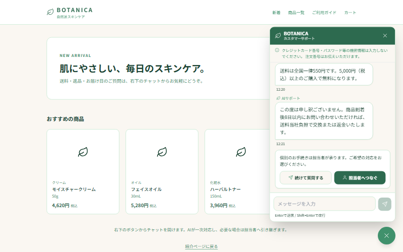

# BOTANICA CSチャットボット

ECサイトに埋め込むカスタマーサポートAIチャットボット。
顧客の問い合わせにまずAIが自動応答し、FAQに根拠がない質問や個別対応が必要な案件だけを人間のオペレーターへ引き継ぎます。

**本番URL：<https://cs-chatbot-portfolio.vercel.app>**

> 自然派スキンケアブランド「BOTANICA」を想定した模擬案件です。
> 月500件の問い合わせのうち70%をAIが自動対応することを目標に設計しています。



---

## デモの試し方

<https://cs-chatbot-portfolio.vercel.app/demo-ec> から、ECサイトに埋め込んだ状態のチャットを体験できます。

1. 右下のチャットボタンを押す
2. ご自身の **Gemini APIキー** を入力する（[Google AI Studio](https://aistudio.google.com/apikey) で無料取得できます）
3. 質問を送る（「送料について」などの質問例ボタンもあります）



> **デモで入力したAPIキーはサーバーに保存されません。** 会話内容もデータベースに記録されません。
> キーはブラウザ内にのみ保持され、AI呼び出しのたびにサーバーへ渡して使い捨てにしています。
> 画面に表示されるのは先頭4文字と末尾4文字だけです。

試せる質問の例：

| 質問 | AIの挙動 |
|---|---|
| 送料はいくらですか | FAQを根拠に回答して完結 |
| 届いた商品が壊れていました | FAQ案内＋「担当者へつなぐ／続けて質問する」の選択肢 |
| 先週の注文の請求が二重になっています | 回答せず担当者へ引き継ぎ |
| BOTANICAの株価は？ | 回答せず担当者へ引き継ぎ（ハルシネーション対策） |

---

## 機能一覧

### 顧客向けチャットウィジェット

- [x] ECサイト右下に常駐するチャットウィジェット
- [x] 匿名サインインによる自動セッション開始（会員登録不要）
- [x] AIによるFAQ根拠の自動応答
- [x] ハルシネーション（AIが事実でないことを答える現象）対策
- [x] 3段階のエスカレーション判定（AI完結／選択肢提示／即引き継ぎ）
- [x] オペレーター返信のリアルタイム受信
- [x] 会話履歴の保持（ページを閉じても再開できる）
- [x] 営業時間外の自動案内
- [x] 連打対策・入力文字数制限
- [x] 新着メッセージのフェードイン表示（`prefers-reduced-motion` 対応）
- [x] スマートフォン対応



### AI応答

- [x] Gemini 2.5 Flash による自動応答
- [x] 登録FAQのみを根拠にした回答（FAQ外は回答しない）
- [x] JSON構造化出力による判定の安定化
- [x] 直近5往復の文脈を踏まえた応答
- [x] タイムアウト（15秒）・APIエラー時のフォールバック
- [x] AIが落ちても必ず人間へ引き継ぐフェイルセーフ設計



### ソフトエスカレーション

FAQで案内はできるが個別手続きも必要な案件（商品破損・返品など）で、
AIが一方的に人へ回さず、顧客に行き先を選んでもらう仕組みです。

- [x] FAQを根拠にした案内＋お詫びを提示
- [x] 「担当者へつなぐ」「続けて質問する」の選択肢
- [x] 選択待ち状態をサーバー側で保持（リロードしても選択肢が復元される）



### オペレーター管理画面

- [x] メール・パスワード認証によるログイン
- [x] 問い合わせ一覧（未対応／対応中／完了で絞り込み）
- [x] ログイン時の未対応件数の通知
- [x] 会話詳細（AIとのやり取りも含めた全履歴）
- [x] 返信送信・担当者の自動割り当て
- [x] リアルタイム更新（新着が5秒以内に反映）
- [x] 会話の完了操作
- [x] タブレット対応


### FAQ管理

- [x] FAQの追加（カテゴリ・質問・回答）
- [x] 有効／無効の切り替え（無効にすると即座にAIの根拠から外れる）
- [x] 登録件数・有効件数の表示


### 営業時間設定

- [x] 営業開始・終了時刻
- [x] 定休曜日・特定休業日
- [x] 「本日休業」の即時切り替え
- [x] タイムゾーン設定
- [x] 時間外は安全側（営業時間外）に倒す判定


### セキュリティ

- [x] 全テーブルでRLS（行レベルセキュリティ）有効
- [x] 顧客は自分の会話のみ閲覧可能（他の顧客の会話は一切見えない）
- [x] 顧客の書き込みは Server Action 経由のみ（ブラウザから直接DBを操作できない）
- [x] オペレーター権限の判定を匿名ユーザーと厳密に分離
- [x] シークレット（サービスロールキー・APIキー）をサーバー専用に限定
- [x] システムプロンプトをクライアントへ配信しない

---

## 技術スタック

| レイヤー | 技術 |
|---|---|
| フレームワーク | Next.js 15（App Router） |
| 言語 | TypeScript |
| DB / 認証 / Realtime / RLS | Supabase（PostgreSQL） |
| AI | Gemini 2.5 Flash |
| スタイリング | Tailwind CSS |
| アニメーション | Framer Motion |
| 定期実行 | pg_cron（放置された会話の自動クローズ） |
| デプロイ | Vercel |
| 状態管理 | React の useState / useEffect のみ |
| アイコン | SVG線アイコン（外部アイコンライブラリ不使用） |

---

## 設計上のポイント

### 匿名サインインによる RLS と Realtime の両立

顧客に会員登録を求めないため、当初はセッションIDで顧客を識別する案でした。しかしセッションIDはブラウザ側で自由に書き換えられるため、RLSの識別子として機能しません。

Supabaseの **匿名サインイン** で顧客にもJWTを発行し、`auth.uid()` で識別する構成に変更しました。これによりRLSが正しく機能し、Realtimeの購読もRLS配下で安全に動きます。

**注意点：匿名サインインしたユーザーのPostgresロールは `anon` ではなく `authenticated` です。** そのため `auth.role() = 'authenticated'` をオペレーター判定に使うと、匿名顧客全員に全権限が渡ります。JWTの `is_anonymous` クレームで判定する専用関数を用意しています。

### 読み取りと書き込みで防御層を分ける

| 操作 | 経路 | 防御 |
|---|---|---|
| 顧客の読み取り | ブラウザから直接 | RLS（`customer_user_id = auth.uid()`） |
| 顧客の書き込み | Server Action 経由のみ | Cookie上のJWTを署名検証 → 会話の所有権を突合 |

Server Action はサービスロールキーで動くためRLSが効きません。引数で渡された顧客IDを信用せず、必ずJWTから確定させています。

### フェイルセーフ設計

AIが答えられない・落ちた場合は「人間へ引き継ぐ」が常に正解になります。

- FAQ取得に失敗 → エスカレーション
- Gemini がタイムアウト・エラー → エスカレーション
- 応答が壊れたJSON → エスカレーション
- 営業時間の判定に迷う → 時間外（安全側）に倒す

AIが黙るくらいなら担当者につなぐほうが、顧客体験として常に正しいという考え方です。

---

## ローカル開発の起動手順

### 前提

- Node.js 20 以上
- Supabase プロジェクト
- Gemini API キー（[Google AI Studio](https://aistudio.google.com/apikey)）

### 手順

```bash
# 1. リポジトリを取得
git clone https://github.com/usako-ui/CS-chatbot-portfolio.git
cd CS-chatbot-portfolio

# 2. 依存パッケージをインストール
npm install

# 3. 環境変数を設定
cp .env.example .env.local
# .env.local を開き、Supabase と Gemini の値を設定する

# 4. 開発サーバーを起動
npm run dev
```

<http://localhost:3000> を開きます。

### Supabase 側の必須設定

```
Authentication > Providers > Anonymous を有効化する
```

**未設定だと顧客側の匿名サインインが 422 エラーになり、チャットが全く動きません。**

### 環境変数

| キー名 | 用途 | 公開範囲 |
|---|---|---|
| `NEXT_PUBLIC_SUPABASE_URL` | ブラウザからの接続URL | ブラウザに配信される |
| `NEXT_PUBLIC_SUPABASE_ANON_KEY` | 管理画面Auth・顧客Realtime | ブラウザに配信される |
| `SUPABASE_URL` | サーバー側からの接続URL | サーバー専用 |
| `SUPABASE_SERVICE_ROLE_KEY` | Server Action 用 | **サーバー専用** |
| `GEMINI_API_KEY` | AI呼び出し | **サーバー専用** |

> `SUPABASE_SERVICE_ROLE_KEY` と `GEMINI_API_KEY` に `NEXT_PUBLIC_` を付けないでください。
> ブラウザへ配信され、全データが誰でも読み書きできる状態になります。

### ビルド

```bash
npm run build
```

> `npm run dev` の起動中に `npm run build` を実行しないでください。
> 同じ `.next` を奪い合って壊れます。先に開発サーバーを止めてください。

---

## ドキュメント

| ドキュメント | 対象読者 | 内容 |
|---|---|---|
| [オペレーター向け操作マニュアル](docs/manual-operator.md) | サポート担当者 | ログイン・返信・完了・営業時間設定 |
| [FAQ編集者向けマニュアル](docs/manual-faq.md) | FAQ管理者 | FAQの追加・有効無効・良い書き方 |
| [開発者向け引き継ぎドキュメント](docs/manual-developer.md) | エンジニア | 構成・RLS・Realtime・AIモデル変更 |
| [検証シナリオ](docs/test-scenarios.md) | エンジニア | AI判定の検証パターン |
| [要件定義書](requirements.md) | 全員 | 機能要件・DBスキーマ・受入条件 |

---

## スコープ外（Phase 2 以降）

今回のMVPでは以下を実装していません。

- Shopify の在庫・配送リアルタイム照会
- 感情分析・分析ダッシュボード・週次レポート
- 返信テンプレート機能
- 商品レコメンド機能
- Slack・メール・LINE への外部通知連携
- FAQ の編集・CSV一括インポート（追加と有効／無効切替のみ）
- 会話データの自動削除機能

---

## ライセンス

ポートフォリオ用の模擬案件です。実在の企業・ブランドとは関係ありません。
