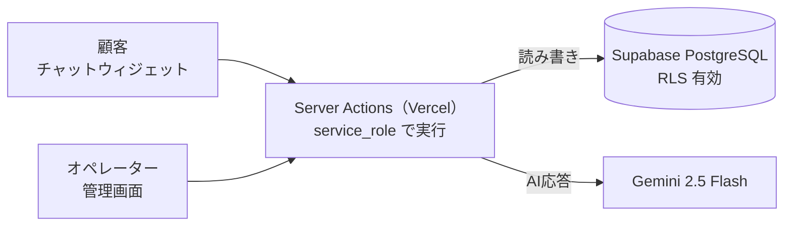
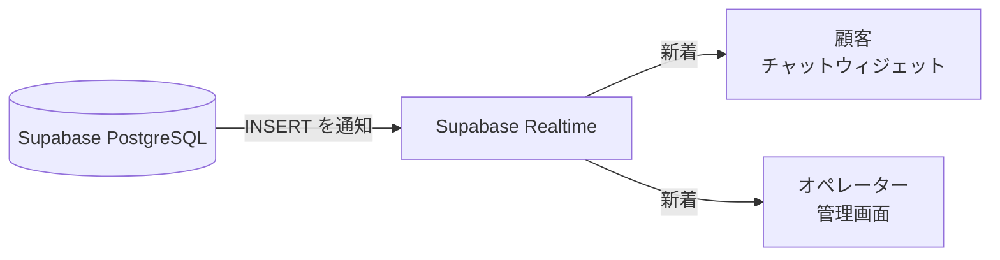
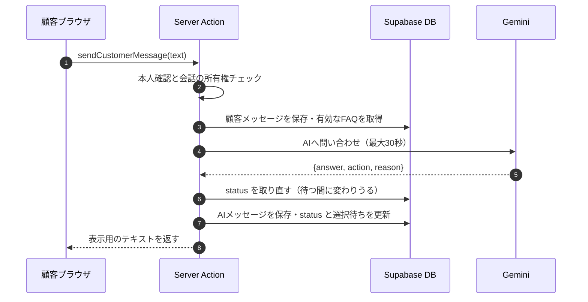
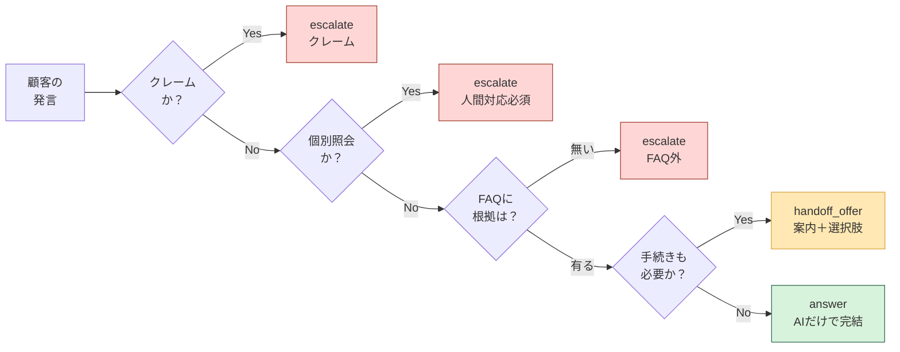
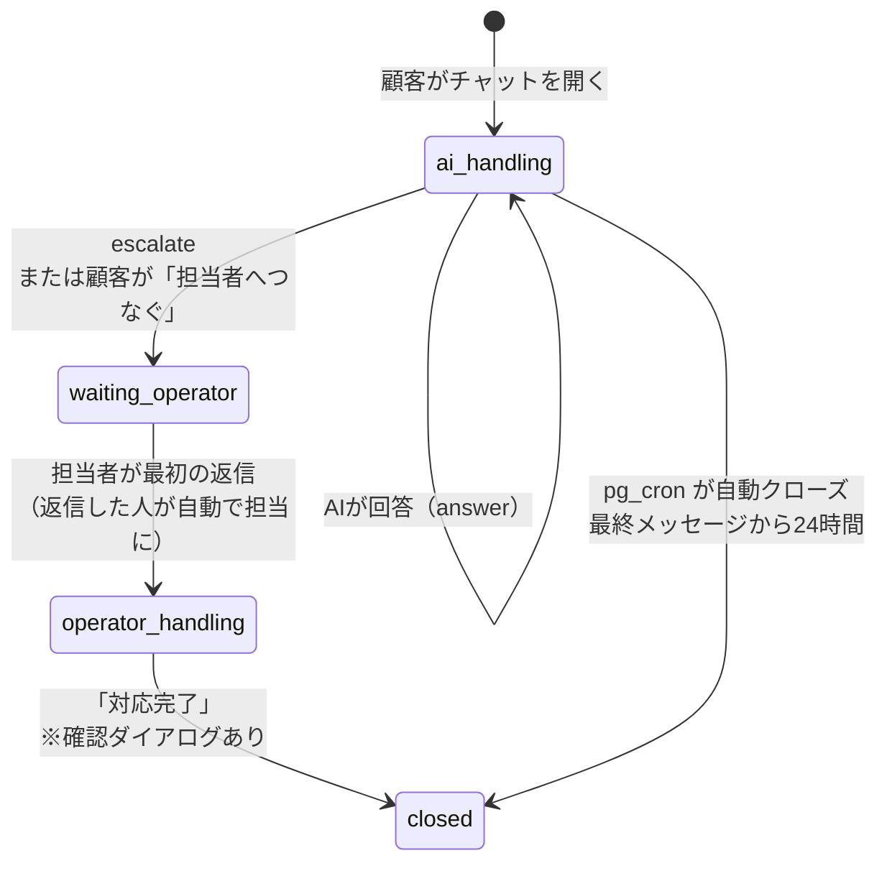
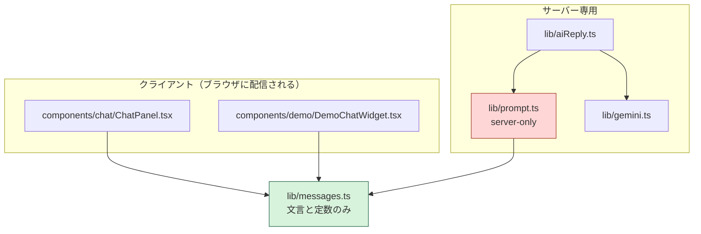
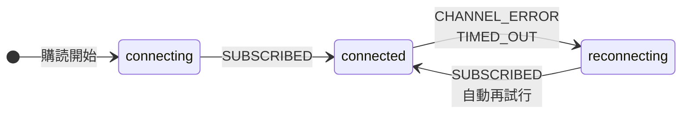
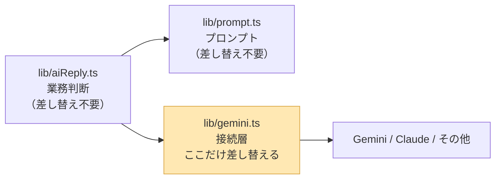

# 開発者向け引き継ぎドキュメント（詳細版）

> **初めての方は [docs/manual-developer.md](manual-developer.md)（クイックスタート）を
> 先に読んでください。このファイルは詳細設計の参照用です。**

このシステムを引き継いで開発を続ける方向けの技術資料です。

---

## 目次

1. [5分で全体像](#1-5分で全体像)
2. [メッセージ1往復の流れ](#2-メッセージ1往復の流れ)
3. [エスカレーションの分岐](#3-エスカレーションの分岐)
4. [ディレクトリ構成とファイルの責務](#4-ディレクトリ構成とファイルの責務)
5. [環境変数一覧](#5-環境変数一覧)
6. [RLSポリシーの意図と検証方法](#6-rlsポリシーの意図と検証方法)
7. [Realtime購読と再接続](#7-realtime購読と再接続)
8. [AIモデル変更とリグレッションテスト](#8-aiモデル変更とリグレッションテスト)
9. [触ると壊れる箇所](#9-触ると壊れる箇所) ← **変更前に必読**
10. [本番移行時の残作業](#10-本番移行時の残作業)
11. [AIへの引き継ぎ](#11-aiへの引き継ぎclaude-code)
12. [用語集](#用語集)

> 急ぎの場合は **1 → 3 → 9** の3つだけ読んでください。
> 全体像・業務ロジックの核・壊しやすい箇所が押さえられます。

### 基本情報

| 項目 | 値 |
|---|---|
| 本番URL | <https://cs-chatbot-portfolio.vercel.app> |
| リポジトリ | <https://github.com/usako-ui/CS-chatbot-portfolio> |
| フレームワーク | Next.js 15.5（App Router） |
| DB / Auth / Realtime | Supabase（PostgreSQL） |
| AI | Gemini 2.5 Flash |
| デプロイ | Vercel |

自然派スキンケアEC「BOTANICA」（架空）向けのCSチャットボットです。ECサイトの右下に埋め込むチャットウィジェットで、顧客の問い合わせにまずGemini APIが自動応答し、FAQに根拠がない質問・個別対応が必要な案件だけを人間のオペレーターへ引き継ぎます。

---

## 1. 5分で全体像

### システム構成

**書き込み**は必ず Server Action を通ります。



**画面への反映**は Realtime が担います。




**この2枚が構成のすべてです。** 書き込みは一方通行、反映も一方通行で、
両者が交わるのは Supabase の中だけです。

認証はSupabase Authで、**顧客は匿名サインイン・オペレーターはメール＋パスワード**と経路を分けています。

**設計の要点は3つです。**

1. **顧客の書き込みは必ず Server Action を通る。** ブラウザから直接 Supabase に書く経路はありません（顧客向けの INSERT/UPDATE ポリシーが存在しないため、書こうとしても拒否されます）。
2. **Server Action は `service_role` で動くのでRLSが効かない。** 本人確認はアプリ側の責任です（→[6章](#6-rlsポリシーの意図と検証方法)）。
3. **読み取りの反映だけ Realtime を使う。** 担当者の返信が顧客画面に出るのはこの経路です（本番実測 390ms・2026-09-02）。

### 3つの入口

| URL | 用途 | 認証 | DB保存 | Gemini |
|---|---|---|---|---|
| `/` | 紹介ページ（ランディング） | なし | なし | 使わない |
| （本番チャット）※1 | ECサイト埋め込みの想定 | 匿名サインイン | **あり** | 開発者のキー |
| `/demo-ec` | 体験用デモ | なし | **なし**（読み取りもしない） | **体験者が入力したキー** |
| `/login` `/dashboard` `/faq` `/settings` | 管理画面 | メール＋パスワード | あり | 使わない |

> **※1 本番チャットのURLはこの公開ドキュメントには記載していません。**
> サーバー側のAPIキーで動くため、URLを知っている人だけが使う運用にしています
> （不特定多数のアクセスでAPI利用量が膨らむのを避けるため）。
> トップページからもリンクを張っていません。実際のパスは `next.config.mjs` の
> `redirects()` と `app/` のディレクトリを参照してください。
>
> `/chat` は `next.config.mjs` の `redirects()` で本番チャットへ307転送しています。
> middleware ではなくここで処理しているのは、middleware の matcher に足すと
> 匿名サインイン前のアクセスにも Auth 問い合わせが走るためです。静的な転送に認証は不要です。

---

## 2. メッセージ1往復の流れ

顧客が1通送ってから画面に返答が出るまでです。



- **6番が重要です。** AI応答を待つ最大30秒の間に顧客が「担当者へつなぐ」を押していることがあります。冒頭で読んだ status を信じて書くと、引き継ぎ案内の直後にAIの回答が差し込まれます。
- `action` による分岐（`answer` / `handoff_offer` / `escalate`）は[3章](#3-エスカレーションの分岐)を参照してください。
- `escalate` のときは `waiting_operator` になり、Realtime でオペレーターの一覧に反映されます。

担当者が返信したときは逆向きです。`actions/operator.ts` が `messages` に INSERT → Supabase Realtime が顧客ブラウザへ push → `useConversationMessages.ts` が受け取って吹き出しを追加します。

---

## 3. エスカレーションの分岐

**このシステムの心臓部です。** AIが「自分で答える」「案内して選ばせる」「人へ回す」のどれを選ぶかを決めます。

### 判定フロー



> **迷ったときは安全側（`escalate` > `handoff_offer` > `answer`）へ倒す**方針をプロンプトに明記しています。
> 判定ルールの本体は `lib/prompt.ts` の【対応方針の判定】です。
>
> 図に無い経路がもう1本あります。**Gemini がエラー・タイムアウトになった場合**は、
> AIの判断を経ずにアプリ側が `escalate` / `AIエラー` を付けます。
>
> **赤（escalate）は `waiting_operator` へ進みます。** `handoff_offer` は顧客が
> 「担当者へつなぐ」を選んだときだけ `waiting_operator` になり、
> 「続けて質問する」なら `ai_handling` のまま続きます（→[会話ステータスの遷移](#会話ステータスの遷移)）。

### なぜ3値なのか（ソフトエスカレーションを入れた理由）

当初は「AIで完結」か「即人間へ引き継ぎ」の2択しかなく、**FAQで案内はできるが個別手続きも必要な案件**（商品破損・返品手続きなど）の受け皿がありませんでした。

- AIが一方的に人へ回すと、**案内を読めば済む人まで待たせる**
- AIだけで終わらせると、**手続きをしたい人が行き止まりになる**

そこでFAQ案内＋お詫びを出したうえで、顧客に「担当者へつなぐ」「続けて質問する」を選ばせる `handoff_offer` を追加しました。`escalate: boolean` を `action: 'answer' | 'handoff_offer' | 'escalate'` に置き換えた形です。

**選択待ちの状態はサーバー側（`conversations.pending_handoff`）で保持します。** ページを再読み込みしても選択肢が復元される必要があるためです。

### 3つの action の違い

| action | 顧客に見えるもの | ステータス | 使う場面 |
|---|---|---|---|
| `answer` | AIの回答本文 | `ai_handling` のまま | FAQで完結する質問（送料・ポイント有効期限など） |
| `handoff_offer` | FAQ案内＋お詫び＋**選択肢2つ** | `ai_handling` のまま<br/>`pending_handoff = true` | 案内はできるが手続きも要る（商品破損・返品） |
| `escalate` | **固定文のみ**（AIの文章は使わない） | `waiting_operator` | クレーム・FAQ外・個別照会・AIエラー |

### 理由コードと顧客表示文言

`escalate` のときにAIの文章をそのまま出さないのは、引き継ぎの案内を毎回同じ表現に固定して顧客の混乱を防ぐためです。対応表は `lib/messages.ts` にあります。

| 理由コード | 顧客表示文言 | 誰が付けるか |
|---|---|---|
| `クレーム` | ご不満をおかけして大変申し訳ございません。担当者が直接ご対応いたします。少々お待ちください。 | Gemini |
| `FAQ外` | 担当者に確認してご対応いたします。少々お待ちください。 | Gemini |
| `人間対応必須` | 担当者に確認してご対応いたします。少々お待ちください。 | Gemini |
| `個別手続き` | 担当者に確認してご対応いたします。少々お待ちください。 | Gemini |
| `AIエラー` | **担当者に接続しています。** | **アプリ**（Geminiは動いていない） |
| 未知の値 | 「担当者に確認して…」へフォールバック | — |

> **「担当者に接続しています。」だけは意味が違います。** これはAIの判断ではなく、
> Gemini の呼び出しが失敗したときにアプリが付ける文言です。
> 「AIの精度が悪い」と誤診しやすいので、障害切り分けのときは真っ先に疑ってください。

**クレームだけ文言を分けている理由：** 謝罪文を全ケースに使うと、怒っていない顧客（住所変更・配送状況の確認）にまで謝ることになります。逆に謝罪なしで統一すると、お怒りの顧客に冷たく響きます。Geminiが区別できなかった場合は「謝らない側」へ倒れる設計です。

### 会話ステータスの遷移



> - `waiting_operator` は**自動クローズしません。** 放置を色分けとバッジで気づかせます。
> - `closed` にすると顧客側では**新しい問い合わせとして始まり**、過去履歴は表示されません。

| 遷移 | 実装 | 制約 |
|---|---|---|
| → `waiting_operator` | `actions/chat.ts` | 時間内・時間外どちらでも遷移する（時間外は通知しないだけ） |
| → `operator_handling` | `sendOperatorReply()` | 未割当なら返信者を担当者に自動セット |
| → `closed` | `closeConversation()` | **`operator_handling` からのみ。** 人が一度も見ていない問い合わせが消えるのを防ぐ |
| 自動クローズ | `private.close_stale_ai_conversations()` | `supabase/cron.sql` で作成。`0 * * * *`（毎時0分）。選択待ちは72時間まで猶予 |

> **`closed` は一方通行です。** 戻す機能はありません（→[10章](#10-本番移行時の残作業)の改善提案）。

---

## 4. ディレクトリ構成とファイルの責務

### 全体

```
案件4 CSチャットボット/
├── app/            ページ（App Router）
├── actions/        Server Actions（'use server'）
├── lib/            ドメインロジック・外部接続
├── components/     Reactコンポーネント
├── types/          型定義（全エージェント参照用）
├── supabase/       seed.sql（FAQ初期データ）・cron.sql（自動クローズ）
├── scripts/        検証スクリプト（.mjs・Gemini直接）
└── docs/           納品ドキュメント（公開）
```

### ページ（`app/`）

Route Group で3系統に分けています。カッコ書きの階層名はURLに現れません。

```
app/
├── page.tsx                          ランディング（紹介ページ）
├── layout.tsx                        ルートレイアウト
├── (**本番チャット**)/…/page.tsx     本番チャット（匿名サインイン・DB保存あり）
│                                     ※URLは公開ドキュメントに書かない方針。
│                                     　実際の名前は app/ を参照
├── (demo-ec)/demo-ec/page.tsx        体験デモ（体験者のAPIキー・DB保存なし）
└── (operator)/
    ├── layout.tsx                    管理画面グループ（シェルは各ページ側で使う）
    ├── login/page.tsx                ログイン
    ├── dashboard/page.tsx            問い合わせ一覧
    ├── dashboard/[id]/page.tsx       会話詳細・返信
    ├── faq/page.tsx                  FAQ管理
    └── settings/page.tsx             営業時間設定
```

### Server Actions（`actions/`）

| ファイル | 責務 |
|---|---|
| `chat.ts` | 顧客チャットの1往復。メッセージ保存 → AI応答 → エスカレーション判定 |
| `operator.ts` | オペレーターの返信・会話の完了 |
| `dashboard.ts` | 一覧取得・FAQ操作・営業設定 |
| `demo.ts` | デモ用。体験者のAPIキーでAIを呼ぶ。**DBには一切書かない** |

> **すべての Server Action は `service_role` で動くためRLSが効きません。**
> 顧客IDは必ず `requireCustomerId()` で Cookie 上のJWTを検証して確定させ、
> `conversationId` は必ず `requireOwnedConversation()` で所有権を突合します。
> **引数で渡された userId を信用した時点でセキュリティが崩れます。**

### ドメインロジック（`lib/`）

| ファイル | 責務 |
|---|---|
| `gemini.ts` | Gemini API 接続層。**業務ロジックを持ち込まない** |
| `prompt.ts` | システムプロンプト組み立て。`server-only` |
| `messages.ts` | 顧客に見せる固定文言・エスカレーション理由コード |
| `aiReply.ts` | AI応答の中核。**例外を投げない**（失敗時もエスカレーションを返す） |
| `conversations.ts` | 会話の所有権チェック・メッセージ操作 |
| `faq.ts` | FAQ取得・プロンプト用テキスト生成 |
| `demoFaq.ts` | 体験デモ用の組み込みFAQ。デモはDBを見ずここを使う |
| `businessHours.ts` / `businessHoursRules.ts` | 営業時間判定（DB取得と判定ロジックを分離） |
| `validation.ts` | 入力検証 |
| `env.ts` | 環境変数の取得（未設定時に原因の分かるエラーを出す） |
| `session.ts` | 匿名サインイン・セッション再作成 |
| `currentOperator.ts` / `operatorData.ts` | オペレーター情報 |
| `supabase/admin.ts` | `service_role` クライアント（サーバー専用） |
| `supabase/server.ts` | CookieからJWTを読むサーバークライアント・本人確認 |
| `supabase/client.ts` | ブラウザ用の anon クライアント |

### 依存の向き（これを崩さないこと）



**`lib/prompt.ts` と `lib/messages.ts` の分離が最重要です。** 固定文言はクライアントコンポーネントも参照します。`prompt.ts` に文言を置いたままだと、文言を1つ import しただけでシステムプロンプト本体がクライアントの依存に入ります。本番ビルドでは tree-shaking で消えますが、`prompt.ts` に副作用が1つ入るだけで**エスカレーション判定ルールごと公開JSに載ります**。

依存の向きを `messages.ts ← prompt.ts` の一方向に固定し、`prompt.ts` には `server-only` を付けてあります。クライアントコンポーネントが誤って import した瞬間にビルドエラーになります。

### コンポーネント（`components/`）

```
chat/       顧客ウィジェット
            ChatWidget → ChatPanel → MessageBubble / HandoffChoice / Notices
            useConversationMessages.ts が Realtime 購読
demo/       デモ用ウィジェット（DemoChatWidget）
operator/   管理画面
            Sidebar・ConversationList・ConversationDetailClient・
            OpenTodayToggle・WaitingModal・StatusBadge
            useOperatorRealtime.ts が管理側の Realtime 購読
landing/    ランディング専用（モックUI含む）
store/      StoreFront.tsx を本番チャットと /demo-ec で共有
icons/      SVG線アイコン（外部アイコンライブラリ・絵文字は使わない方針）
```

---

## 5. 環境変数一覧

値は `.env.local`（Git管理外）と Vercel のプロジェクト設定にあります。ここには **キー名と用途のみ** 記載します。

| キー名 | 用途 | 公開範囲 |
|---|---|---|
| `NEXT_PUBLIC_SUPABASE_URL` | ブラウザからSupabaseへ接続するURL | ブラウザに配信される |
| `NEXT_PUBLIC_SUPABASE_ANON_KEY` | 管理画面Auth・顧客Realtime用の公開キー | ブラウザに配信される |
| `SUPABASE_URL` | サーバー側からの接続URL | サーバー専用 |
| `SUPABASE_SERVICE_ROLE_KEY` | Server Action用。**RLSを迂回する** | **サーバー専用・絶対に公開しない** |
| `GEMINI_API_KEY` | Gemini API 呼び出し | **サーバー専用・絶対に公開しない** |
| `LIVE_CHAT_CLOSED` | `1` で顧客チャットを停止し、受付終了の案内ページを表示する（任意・既定は未設定） | サーバー専用 |

> **`SUPABASE_SERVICE_ROLE_KEY` と `GEMINI_API_KEY` に `NEXT_PUBLIC_` を付けてはいけません。**
> 付けた瞬間にブラウザへ配信され、全顧客の会話データが誰でも読み書きできる状態になります。
> RLSはこのキーを迂回するため、ポリシーでは守れません。
> 万一配信した場合は変数を消すだけでは不十分で、Supabase側でキーのローテートが必要です。

環境変数を追加したら `.env.example` を必ず同期更新してください。

> AIサービスを Claude API 等へ差し替える場合は `ANTHROPIC_API_KEY` のような
> 別のキーが増えます。**その場合も `NEXT_PUBLIC_` を付けないこと**（→[8章](#8-aiモデル変更とリグレッションテスト)）。

### 配信物の検証方法

秘密情報がブラウザに漏れていないかは、ビルド成果物を全文検索して確かめます。

```bash
rm -rf .next && npx next build
grep -rl "<キーの値>" .next/static   # 何も出なければOK
```

本番に対してはHTMLとJSチャンクを取得して全文検索します。2026-09-01 時点で秘密情報・システムプロンプトとも0件を確認済みです。

---

## 6. RLSポリシーの意図と検証方法

### 設計の考え方

顧客にも **Supabase匿名サインイン** でJWTを発行し、`auth.uid()` で識別します。当初案の `customer_session_id`（クライアントが自由に名乗れる文字列）はRLSの識別子として機能しないため廃止しました。

| リクエスト | Postgres ロール | できること |
|---|---|---|
| JWTなし | `anon` | 有効なFAQの読み取りのみ |
| 匿名サインインの顧客 | **`authenticated`** | 自分の会話の SELECT のみ |
| オペレーター | **`authenticated`** | 全テーブル ALL |

> **最重要：匿名サインインしたユーザーの Postgres ロールは `anon` ではなく `authenticated` です。**
> そのため `auth.role() = 'authenticated'` をオペレーター判定に使うと、
> **匿名顧客全員に全権限が渡ります。** 必ず `private.is_operator()` を通してください。

```sql
CREATE OR REPLACE FUNCTION private.is_operator()
RETURNS boolean LANGUAGE sql STABLE SECURITY DEFINER SET search_path TO ''
AS $$
  SELECT COALESCE((auth.jwt() ->> 'is_anonymous')::boolean, TRUE) = FALSE
     AND auth.uid() IS NOT NULL;
$$;
```

`COALESCE(..., TRUE)` は安全側の設計です。`is_anonymous` クレームが欠けた場合は匿名扱いに倒れ、false を返します。逆にすると、JWTの形が変わった瞬間に全権限が漏れます。

`public` ではなく `private` スキーマに置いているのは、PostgREST 経由で外部から呼べないようにするためです（`anon` にはスキーマの USAGE 権限もありません）。

### ポリシー一覧（全4テーブル・7ポリシー）

| テーブル | ポリシー | 操作 | 対象 |
|---|---|---|---|
| conversations | `customer_select_own_conversation` | SELECT | `customer_user_id = (SELECT auth.uid())` |
| conversations | `operator_all_conversations` | ALL | `private.is_operator()` |
| messages | `customer_select_own_messages` | SELECT | 自分の会話に属するもののみ |
| messages | `operator_all_messages` | ALL | `private.is_operator()` |
| faqs | `faq_read_active` | SELECT | `is_active = true`（`anon` 含む） |
| faqs | `operator_all_faqs` | ALL | `private.is_operator()` |
| business_settings | `operator_all_business_settings` | ALL | `private.is_operator()` |

**顧客向けは SELECT のみで、INSERT/UPDATE/DELETE のポリシーが存在しません。** 顧客の書き込みはすべて Server Action 経由という設計です。ポリシーが無い＝拒否なので、ブラウザから直接書き込む経路はありません。

`(SELECT auth.uid())` とサブクエリで囲んでいるのは、PostgreSQL が行ごとに再評価するのを防ぐためです。

### 検証方法

> **「0件返る」ことではなく「自分の1件だけ返る」ことを確認してください。**
> 全拒否で壊れている状態を「安全」と誤読しないためです。

確認する内容は次の4点です。

| # | 確認すること | 期待する結果 |
|---|---|---|
| 1 | 匿名JWTで `conversations` を全件SELECTする | **自分の会話だけ**返る（0件でも全件でもない） |
| 2 | 別の匿名JWTで同じことをする | 互いの会話が見えない |
| 3 | Server Action に他人の `conversation_id` を渡す | 拒否される（`requireOwnedConversation()`） |
| 4 | 匿名JWTで管理画面のデータを取りに行く | 拒否される（`private.is_operator()`） |

現在のポリシー状態はSQLでも確認できます。

```sql
SELECT tablename, policyname, cmd FROM pg_policies
WHERE schemaname = 'public' ORDER BY tablename, policyname;
```

2026-09-01 の監査では顧客側7件・オペレーター側5件すべてPASSでした。

> Supabase のセキュリティアドバイザーが出す `auth_allow_anonymous_sign_ins` は、
> ポリシーの対象ロールが `authenticated` であるだけで機械的に発火するルールです。
> この構成では必ず出ます。実際のガードは `private.is_operator()` 側にあります。

---

## 7. Realtime購読と再接続

顧客側は `components/chat/useConversationMessages.ts`、管理側は `components/operator/useOperatorRealtime.ts` が担当します。

### 接続状態の遷移



> - `SUBSCRIBED` を受けた時点でサーバーから取り直します。**切断中に届いた分もここで埋まります。**
> - `reconnecting` の間は顧客画面に「接続が切れました。再接続しています...」と出るだけです。

**独自の再接続処理は書いていません。** Supabaseクライアントが自動で再試行します。このフックの責務は「接続状態を画面に見せること」と「`SUBSCRIBED` のたびに取りこぼしを回収すること」の2つだけです。

### 押さえるべき4点

**1. 購読前にセッションを確定させる**

`createClient()` の直後に購読すると匿名として接続し、RLSで弾かれて1件も配信されません。購読自体は成功するのでエラーが出ず、切り分けが難しい不具合になります。`ChatPanel` は `ensureAnonymousSession()` を待ってから `conversationId` を state に入れ、それを依存に購読を開始します。

**2. 購読確立後のイベントしか届かない**

`postgres_changes` は購読が確立した後のINSERTしか配信しません。ウィジェットを開いた直後に送信されると取りこぼします。そのため `SUBSCRIBED` を受けた時点でサーバーから取り直します。

```ts
.subscribe((status) => {
  if (status === 'SUBSCRIBED') {
    setConnection('connected');
    // 購読確立前に入ったメッセージを取り戻す。
    // 再接続時もここを通るので、切断中の分もまとめて回収できる
    void syncRef.current(conversationId);
  } else if (status === 'CHANNEL_ERROR' || status === 'TIMED_OUT') {
    setConnection('reconnecting');
  }
});
```

**3. クリーンアップを必ず書く**

`return () => supabase.removeChannel(channel)` を忘れると、再レンダーのたびに購読が積み上がり、1件の受信で同じメッセージが何度も処理されます。

**4. コールバックは ref 経由で呼ぶ**

`appendMessage` を依存配列に入れると、関数の再生成のたびに再購読が走ってチャンネルが張り直されます。`appendRef.current` 経由で呼んで依存を `conversationId` だけに保ちます。

### 検証時の注意

検証スクリプトでウィジェットを開いた直後に管理側からINSERTすると、購読確立前で届きません。**開いてから5秒ほど待ってから投入してください。**

---

## 8. AIモデル変更とリグレッションテスト

AI呼び出しは `lib/gemini.ts` に閉じています。プロンプト組み立ては `lib/prompt.ts`、業務判断は `lib/aiReply.ts`。**この3層の分離を保てば、モデル差し替えの影響は `gemini.ts` に収まります。**



### 同じGeminiで別モデルにする場合

`lib/gemini.ts` の定数を変えるだけです。

```ts
export const GEMINI_MODEL = 'gemini-2.5-flash';
```

### 別のAIサービス（Claude API等）に替える場合

1. `lib/gemini.ts` と同じシグネチャの接続層を作る
   ```ts
   generateAIResponse(systemInstruction, userMessage, history, apiKey?): Promise<AIResponse>
   ```
2. 以下の契約を必ず守る

   | 契約 | 内容 |
   |---|---|
   | 戻り値 | `AIResponse`（`action` は `'answer' \| 'handoff_offer' \| 'escalate'`） |
   | 失敗時 | `GeminiError` 相当の例外を投げる（**握りつぶさない**） |
   | JSON強制 | Geminiの `responseSchema` に相当する仕組みを使う |
   | タイムアウト | **30秒**で打ち切る |

3. `lib/aiReply.ts` の import 先を差し替える
4. `actions/demo.ts` も差し替える（デモは体験者のキーを使う）
5. 環境変数（`ANTHROPIC_API_KEY` など）を `.env.local`・Vercel・`.env.example` に追加する

### リグレッションテスト手順

**プロンプトかモデルを変えたら、必ずこの順で確認してください。**

| # | 確認すること | 方法 | Gemini消費 |
|---|---|---|---|
| 1 | 型・Lint・ビルドが通る | `npx tsc --noEmit` → `npx next lint` → `rm -rf .next && npx next build` | 0 |
| 2 | AI判定が変わっていない | `docs/test-scenarios.md` の8件を実際に送信し、期待値（answer / handoff_offer / escalate）と突き合わせる | 8 |
| 3 | 判定がぶれない | 上記のうち判定が割れやすい1件を**3回連続**で送り、毎回同じ結果になるか見る | 3 |
| 4 | 文言が正しく出し分けられる | クレーム・FAQ外・怒っていない個別依頼を送り、`lib/messages.ts` の対応表どおりの文言が出るか見る | 3 |
| 5 | 本番で動く | デプロイ後に顧客チャットで1件送り、回答内容と担当者返信のRealtime反映を確認する | 1 |

> **2〜5 を通すと15リクエスト消費します。無料枠は日次20なので1日1周が限度です。**
> 日次枠のリセットは日本時間16:00、分次は5リクエストまで。**25秒ほど間隔を空けて**送ってください。
> 枠切れ時は「担当者に接続しています。」が出ます（AIは動いていません）。
>
> 営業時間外の挙動を確認するときは営業設定を一時的に変更します。
> **確認後は必ず元の値（10-18時）に戻してください。**

> 制作時はこれらを Playwright で自動化していましたが、
> 実行時にAPIキーと認証情報を読むためリポジトリには含めていません。

判定基準は `docs/test-scenarios.md` にあります。**AC-002・AC-003・AC-004 が落ちていないこと**が最低ラインです。

### 現在の設定

| 設定 | 値 | 理由 |
|---|---|---|
| `temperature` | `0.1` | 判定のぶれ対策（0.2では同じ質問で判定が割れた） |
| `thinkingConfig.thinkingBudget` | `0` | 2.5 Flashの思考トークンを止めて制限時間内に収める |
| タイムアウト | `30_000` ms | 実測で応答が 1.2秒〜143秒 と不安定。15秒では正常なリクエストまで打ち切られていた |

---

## 9. 触ると壊れる箇所

過去に実際に踏んだ・踏みかけた箇所です。**変更前に必ず目を通してください。**

| # | 箇所 | 壊れ方 |
|---|---|---|
| 1 | `lib/gemini.ts` の本文の正規化 | 本文を空にしてよいのは `escalate` のときだけ。`handoff_offer` で捨てると、謝罪もFAQ案内も届かず引き継ぎ文だけが出る。逆に `handoff_offer` で本文が空なら安全側（`escalate`）へ倒す |
| 2 | `conversations.pending_handoff` | 選択待ちをReactのstateだけで持つとリロードで選択肢が消え、「担当者へつなぐ」を押せないまま会話が宙に浮く（AC-014に抵触） |
| 3 | `actions/chat.ts` の status 再確認 | `resolveAiReply` は最大30秒かかる。その間に顧客が引き継ぎを押すと `waiting_operator` になっている。冒頭で読んだ status を信じて書くと、引き継ぎ案内の直後にAIの回答が差し込まれる。**この再確認を消すと再発する** |
| 4 | `setConversationStatus` | `pending_handoff` を必ず false にする処理を内包している。呼び出し側で個別に落とす必要はない（落とし忘れの温床になる） |
| 5 | `private.close_stale_ai_conversations()` | 選択待ちには72時間の猶予を与えている。猶予なしだと選択肢ごと消える。逆に期限なしで除外すると永久に滞留する |
| 6 | `lib/prompt.ts` の規則の優先順位 | 規則11「FAQに回答がある質問を escalate にしない」と、規則4・7（個別照会・クレームは必ず escalate）の優先順位を明記している。**崩すとAC-002・AC-003が落ちる** |
| 7 | `private.is_operator()` | `auth.role()` での判定に戻すと匿名顧客に全権限が渡る（→[6章](#6-rlsポリシーの意図と検証方法)） |
| 8 | Realtime のクリーンアップ | `removeChannel` を消すと購読が積み上がり、同じメッセージが多重処理される（→[7章](#7-realtime購読と再接続)） |

### 開発時の注意

- **`npx next dev` 起動中に `npx next build` を実行しない。** 同じ `.next` を奪い合って壊れ、ログに何も出ないままページが500や404になります。逆順（build後にdev）でも壊れます。どちらの場合も `rm -rf .next` してから起動し直してください。
- **`tailwind.config.ts` を変更したら dev を再起動する。** 起動中のプロセスは古い設定を持ち続け、追加した色やアニメーションのクラスが生成されません。エラーにならず「なぜかスタイルが当たらない」形で出ます。
- **`next dev` を止めたつもりでも子プロセスが残ることがある。** ポートが塞がっていると自動で3001番へ回り、古いコードを検証してしまいます。`Get-NetTCPConnection -LocalPort 3000 -State Listen` で確認してください。
- **検証後はDBを初期状態に戻す**（会話0件・営業設定10-18時）。

---

## 10. 本番移行時の残作業

1. **Supabase の漏洩パスワード保護を有効化**
   Dashboard → Authentication → Sign In / Providers → Password Security →
   "Leaked password protection"。オペレーターはメール＋パスワードでログインするため、
   流出した使い回しパスワードで侵入されると全顧客の会話が読まれます。
   既存ユーザーがログインできなくなることはありません。
2. **Gemini の有料プランへの切り替え**（無料枠は本番運用を想定していない）
3. **`framer-motion` の要否判断**
   新着メッセージのフェードイン（0.25秒）のみに使っており、First Load JS が
   ウィジェット埋め込みページで 182→222kB 増えています。
   CSSの `@keyframes` でも同じ見た目を作れます。
4. **対応完了の取り消し機能**（改善提案）
   現在は `closeConversation()` が `operator_handling` → `closed` の一方向のみを許可し、
   戻す手段がありません。完了にした会話は顧客側で新しい問い合わせとして始まるため、
   **顧客が未読の返信は読めなくなります。**
   誤操作防止として確認ダイアログは追加済み（`ConversationDetailClient.tsx`）ですが、
   押してしまった後は戻せません。
   - 「対応中に戻す」ボタンの追加（`closed` → `operator_handling` の逆方向遷移）
   - 顧客がチャットを開く前であれば、返信を読める状態に復元できる
   - **顧客がすでに新しい会話を開いた後は復元不可**（設計上の制約）。
     `findOrCreateOpenConversation()` が「未完了の会話のうち最新の1件」を拾うため、
     戻した古い会話より後から作られた新しい会話が優先される
   - 完全に塞ぐには顧客側の会話取得ロジックまで変更範囲が及び、
     **AC-014・Q-009 の確定仕様に影響する**ため要件定義の見直しが必要

---

## 11. AIへの引き継ぎ（Claude Code）

このリポジトリは Claude Code での開発を前提に整理してあります。

```bash
cd "<リポジトリのパス>"
claude
```

### まず `AGENTS.md` を読ませる

リポジトリのルートに **[`AGENTS.md`](../AGENTS.md)** を置いています。
AIエージェント向けの作業ルールを1枚にまとめたもので、
守るべき制約・実行すべきコマンド・リポジトリに含まれないファイルが書いてあります。

```
AGENTS.md と docs/manual-developer.md を読んで、現状を把握してから作業してください。
詳細が必要になったら docs/manual-developer-detail.md を参照してください。
```

**これだけで引き継げるようにしてあります。** 以下はより具体的に指示したい場合の例です。

### そのまま貼って使えるプロンプト

```
このリポジトリは BOTANICA CSチャットボット（Next.js 15 + Supabase + Gemini）です。
まず docs/manual-developer-detail.md を読んで、以下を把握してください。

1. システム構成と3つの入口（1章）
2. エスカレーションの分岐と3つの action（3章）
3. 触ると壊れる箇所8件（9章）

そのうえで、次の制約を必ず守って作業してください。

- 顧客のDB書き込みは必ず Server Action 経由。ブラウザから Supabase を直接叩かない
- Server Action は service_role で動くのでRLSが効かない。
  requireCustomerId() と requireOwnedConversation() を必ず通す
- SUPABASE_SERVICE_ROLE_KEY と GEMINI_API_KEY に NEXT_PUBLIC_ を付けない
- lib/prompt.ts をクライアントコンポーネントから import しない
- any 型を使わない。型は types/index.ts を参照する
- コメントは日本語。エラーハンドリングを省略しない
- npx next dev 起動中に npx next build を実行しない（どちらも rm -rf .next してから）
- Gemini は無料枠（日次20・分次5・リセットは日本時間16:00）。検証の消費量に注意する

作業前に、何をどう変更するかを先に説明してください。
```

### 参照ファイル

| ファイル | 内容 | Git管理 |
|---|---|---|
| `AGENTS.md` | **AIエージェント向けの作業ルール** | 対象 |
| `docs/manual-developer.md` | クイックスタート（起動手順・コマンド） | 対象 |
| `docs/manual-developer-detail.md` | **このファイル。** 設計・RLS・Realtime・AI変更 | 対象 |
| `requirements.md` | 機能要件・DBスキーマ・受入条件（AC-001〜AC-017） | 対象 |
| `docs/test-scenarios.md` | AI判定の検証シナリオと期待値 | 対象 |
| `types/index.ts` | 型定義。`any` を使わずここを参照する | 対象 |

> **環境変数の実値とオペレーターのログイン情報はリポジトリに入っていません。**
> 前者のキー名は `.env.example` にあります。後者は Supabase で新規作成できます
> （手順は[クイックスタート](manual-developer.md)）。

### 受入条件の確認

受入条件は `requirements.md` の AC-001〜AC-017 にあります。
AI判定の期待値は `docs/test-scenarios.md` にまとまっています。

**AC-012（顧客同士の情報分離）は必ず別ブラウザまたはシークレットウィンドウで確認してください。**
同じブラウザだと同一の匿名ユーザーとして扱われ、確認になりません。

---

## 用語集

このドキュメントに出てくる言葉のうち、つまずきやすいものだけをまとめます。

| 用語 | 意味 |
|---|---|
| **Server Action** | Next.js の仕組み。ブラウザから関数を呼ぶと、その中身は**サーバー側で動く**。APIキーやDBのパスワードを扱えるのはこの中だけ。ファイル先頭の `'use server'` が目印 |
| **`service_role` キー** | Supabaseの管理者キー。**RLSを無視して全データを読み書きできる。** サーバー側でしか使わない。漏れると全顧客の会話が読まれる |
| **`anon` キー** | 公開してよいキー。これ単体では権限が無く、RLSに守られた範囲しか触れない。ブラウザに配信される |
| **RLS（行レベルセキュリティ）** | 「誰がどの行を見てよいか」をDB自身に判定させる仕組み。アプリ側でうっかり全件取得しても、DBが自分の行だけに絞ってくれる最後の砦 |
| **JWT** | ログイン状態を表す署名付きの文字列。改ざんすると署名が壊れるので、名乗った内容を信用できる。RLSはこの中身で判定する |
| **匿名サインイン** | メールもパスワードも要らないログイン。顧客に「名前は無いが本人であることは証明できる」IDを配るために使う。**このIDがないとRLSで顧客を区別できない** |
| **Realtime** | DBに行が追加されたことをブラウザへ push する仕組み。担当者の返信が顧客画面に自動で出るのはこれ。ポーリング（定期的に問い合わせる）ではない |
| **`postgres_changes`** | Realtime の購読方式のひとつ。INSERT/UPDATE を受け取る。**購読を始めた後の変更しか届かない** |
| **pg_cron** | PostgreSQL の定期実行。このシステムでは放置された会話の自動クローズに使っている |
| **`server-only`** | 「このファイルをブラウザ側から import したらビルドを失敗させる」印。うっかり秘密がクライアントに載るのを防ぐ |
| **エスカレーション** | AIが答えず人間の担当者へ引き継ぐこと。このシステムの中心的な判断 |
| **ソフトエスカレーション**<br/>（`handoff_offer`） | FAQで案内はしたうえで「担当者へつなぐか」を**顧客に選ばせる**中間の対応。AI完結と即引き継ぎの間を埋める |
| **フォールバック** | 本来の処理が失敗したときの代替動作。ここではAIが落ちたら人間へ回すこと |
| **AC-001〜AC-017** | 受入条件。「何ができたら完成か」の一覧。`requirements.md` にある |

---

## 関連ドキュメント

- [オペレーター向け操作マニュアル](manual-operator.md)
- [FAQ編集者向けマニュアル](manual-faq.md)
- [検証シナリオ](test-scenarios.md)
