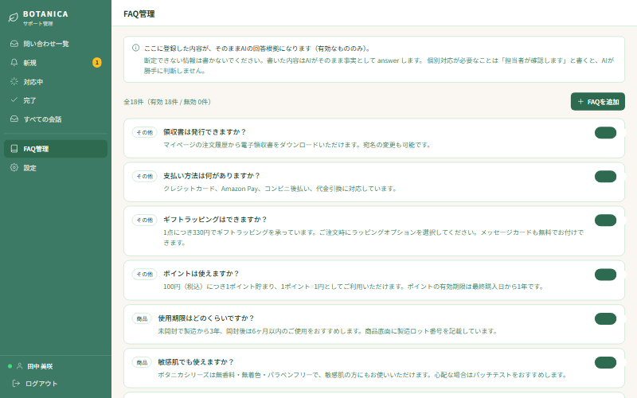

# FAQ編集者向けマニュアル

AIが答えられる内容を追加・変更するための手引きです。
プログラムの知識は不要です。画面から文章を登録するだけで、AIの回答が変わります。

管理画面URL：<https://cs-chatbot-portfolio.vercel.app/login>

---

## FAQとは何か

FAQは「よくある質問と、その答え」を登録しておく一覧です。

このシステムのAIは、**登録されたFAQに書いてあることだけを根拠に回答します。**
インターネットで調べたり、AIが自分の知識で答えたりはしません。
FAQに無いことを聞かれたら、答えずに担当者へ引き継ぎます。

つまり **FAQの内容が、そのままAIの回答範囲になります。**
FAQを増やせばAIが答えられる質問が増え、担当者の対応件数が減ります。

---

## 1. FAQ管理画面を開く

ログイン後、左メニューの「FAQ管理」を押します。

画面上部に **全何件・有効何件・無効何件** が表示されます。
このうち **有効なものだけ** がAIの回答根拠になります。

各FAQには「その他」「商品」などの分類ラベルが付いています。

---

## 2. FAQを追加する

1. 画面右上の「＋ FAQを追加」を押します
2. 以下を入力します

| 項目 | 入力内容 |
|---|---|
| カテゴリ | 分類（配送・返品・商品 など） |
| 質問 | お客様が聞きそうな言葉で書く |
| 回答 | AIがそのまま根拠にする文章 |

3. 保存すると、**すぐにAIの回答に反映されます**（再起動などは不要）

### 追加したら必ず試してください

登録後、実際にチャット画面から質問してみて、意図した回答が返るか確認してください。
デモ画面（<https://cs-chatbot-portfolio.vercel.app/demo-ec>）でも試せます。

---

## 3. FAQの有効・無効を切り替える

各FAQの右端にあるスイッチで切り替えます。

- **緑（オン）＝ 有効** … AIが回答の根拠に使う
- **グレー（オフ）＝ 無効** … AIは使わない。お客様にも表示されない

### 無効にする場面

- キャンペーンが終わった（期間限定の送料無料など）
- 価格や仕様が変わり、書き直すまで使わせたくない
- 内容が古くなった

**削除ではなく無効化を使ってください。** 内容が残るので、後で復活させられます。

> **重要：無効にしてもすぐ反映されます**
> 「明日から」といった予約はできません。オフにした瞬間からAIは使わなくなります。

---

## 4. 良いFAQの書き方（5つのポイント）

### ① 数字・条件は具体的に書く

AIは **FAQに書かれた数字しか使えません。** 書いていない数字を推測して答えることはありません。

| ❌ 悪い例 | ⭕ 良い例 |
|---|---|
| 一定額以上で送料無料です | 5,000円（税込）以上のご購入で送料無料です |
| 早めにご連絡ください | 商品到着後8日以内にご連絡ください |

曖昧に書くと、AIも曖昧にしか答えられません。

### ② 1つのFAQに1つの話題だけ書く

配送と返品を1件にまとめると、AIがどちらを答えるべきか判断しにくくなります。
話題ごとに分けて登録してください。

### ③ お客様が使う言葉で質問を書く

社内用語ではなく、お客様が実際に打ちそうな言葉にします。

| ❌ 悪い例 | ⭕ 良い例 |
|---|---|
| 返品ポリシーについて | 返品できますか？ |
| 定期便解約フロー | 定期購入をやめたいです |

### ④ 断定できないことは書かない

FAQに書いたことは、AIが **そのまま事実として** お客様に伝えます。
「たぶん」「場合による」といった内容は、そのまま断定的に伝わってしまいます。

個別対応が必要なことは、回答欄に **「担当者が確認します」** と書いてください。
そう書いておけば、AIは勝手に判断せず担当者へ引き継ぎます。

### ⑤ 例外条件も一緒に書く

例外を書かないと、AIは例外を知らないまま答えます。

> ⭕ 良い例：
> 「商品到着後8日以内であれば返品を承ります。
> 　ただし開封済みの商品、セール品は対象外です。」

---

## 5. AIが答えられる質問・答えられない質問

### 答えられる質問（FAQに根拠がある一般的な内容）

- 送料はいくらですか
- ポイントの有効期限は
- 定期購入の解約方法を教えてください
- ギフトラッピングはできますか

これらは **AIだけで完結** します。担当者に届きません。

### 選択肢を出す質問（FAQで案内できるが手続きが要る）

- 届いた商品が壊れていました
- 返品したいのですが

AIがまずFAQを根拠に手順を案内し、そのうえでお客様に
**「続けて質問する」／「担当者へつなぐ」** を選んでもらいます。
案内を読めば済む人は待たされず、手続きしたい人は担当者につながります。

### 答えられない質問（必ず担当者へ引き継ぐ）

| 種類 | 例 |
|---|---|
| 特定の注文を調べる依頼 | 先週の注文の請求が二重になっています／私の荷物は今どこですか |
| 個人情報の変更 | 登録した住所を変更したい |
| クレーム・お怒り | 対応が遅すぎる |
| BOTANICAと無関係な質問 | 株価はいくらですか |

**AIはお客様の注文データ・配送状況・請求情報を一切見られません。**
FAQに一般的な手順が書いてあっても、個別の照会は必ず担当者へ回します。

これは意図的な設計です。AIが推測で答えると、
守れない約束をしてしまうためです。

---

## 6. よくある質問

### FAQを追加したのにAIが答えてくれない

3点を確認してください。

1. スイッチが **有効（緑）** になっているか
2. 質問の書き方が、お客様の言葉と離れすぎていないか
3. その質問が「個別の注文を調べる依頼」になっていないか
   （その場合はFAQがあっても意図的に担当者へ回ります）

### AIが間違ったことを答えた

まずFAQの内容を確認してください。
**AIはFAQに書いてあることしか言いません。** 誤りがあればFAQ側にあります。

FAQが正しいのに違う回答が出る場合は、システム管理者にご連絡ください。

### FAQを編集したい

現在の管理画面では **追加と有効・無効の切り替えのみ** です。
既存FAQの文言修正はできません。

修正したい場合は、**正しい内容で新しく追加してから、古いほうを無効にしてください。**

### 何件くらい登録するとよい？

現在18件登録されています。
問い合わせの多い順に増やしていくのが効果的です。
管理画面の「完了」から、実際にどんな質問が担当者に回っているかを確認し、
繰り返し出てくるものをFAQに追加してください。

### 登録した内容はお客様に直接見えますか

FAQ一覧そのものはお客様に表示されません。
AIが回答を作るときの根拠として使われ、AIの言葉で伝えられます。

---

## 関連ドキュメント

- [オペレーター向け操作マニュアル](manual-operator.md) — 問い合わせへの返信方法
- [開発者向け引き継ぎドキュメント](manual-developer.md) — システムの技術情報
