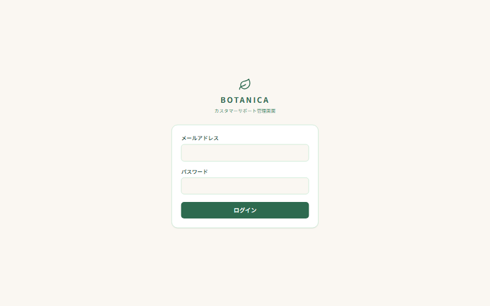
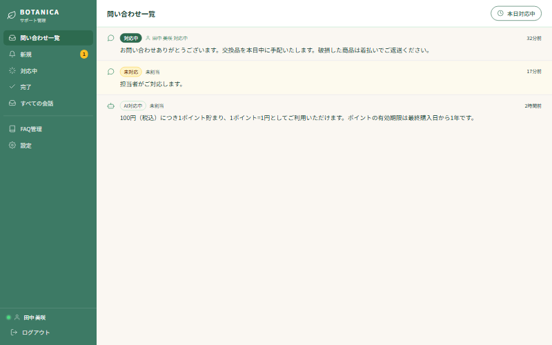
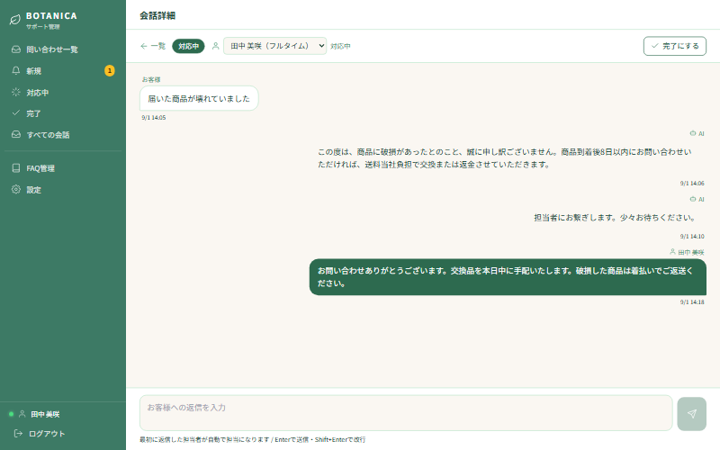
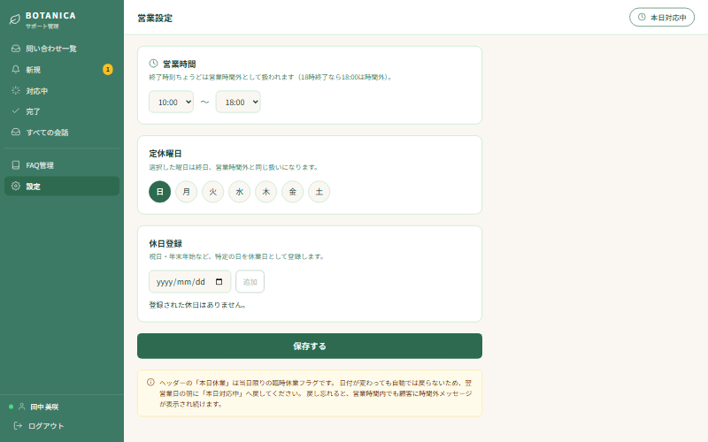

# オペレーター向け操作マニュアル

BOTANICA カスタマーサポート管理画面の使い方です。
お客様からの問い合わせを確認し、返信するまでの流れを説明します。

管理画面URL：<https://cs-chatbot-portfolio.vercel.app/login>

---

## このシステムでできること

お客様がECサイトの右下にあるチャットから質問すると、まずAIが自動で答えます。
AIが答えられない質問だけが、この管理画面に届きます。

つまり **管理画面に上がってくる時点で「人が対応すべき問い合わせ」** です。
すべての質問を見る必要はありません。

---

## 1. ログインする

1. 管理画面URLを開きます
2. メールアドレスとパスワードを入力します
3. 「ログイン」を押します

ログインすると、その時点で **未対応の問い合わせが何件あるか** がお知らせとして表示されます。
確認したら「閉じる」を押してください。

> **パスワードを忘れた場合**
> 画面上からは再設定できません。システム管理者（開発担当者）にご連絡ください。

> **ログインしたままにしてよいか**
> 共有パソコンの場合は、離席時に左下の「ログアウト」を押してください。
> ログインしたままだとお客様の会話内容を第三者に見られる可能性があります。

---

## 2. 問い合わせ一覧を見る

ログインすると問い合わせ一覧が表示されます。新しいものが上に並びます。

### 左側のメニュー

| メニュー | 表示される内容 |
|---|---|
| 問い合わせ一覧 | **対応が必要な会話**（AI対応中・未対応・対応中）を新しい順に表示 |
| 新規 | まだ誰も返信していないもの（**ここから対応します**） |
| 対応中 | 誰かが返信を始めたもの |
| 完了 | 対応が終わったもの（自動完了したものも含む） |
| すべての会話 | 完了済みも含めた全部 |

「問い合わせ一覧」には**完了済みは含まれません。**
完了した会話は「完了」または「すべての会話」から確認できます。

**普段は「問い合わせ一覧」を開いておけば、対応が必要なものだけが並びます。**

「新規」の横にオレンジ色の数字が出ていたら、その件数だけ未対応の問い合わせがあります。

### ステータス（対応状況）の見方

| 表示 | 意味 | やること |
|---|---|---|
| **未対応** | AIが答えられず、人の対応を待っている | できるだけ早く返信する |
| **対応中** | 誰かが返信済み。やり取りの途中 | 続きを対応する |
| **完了** | 対応が終わっている | 何もしなくてよい |

「未割当」と出ている場合は、まだ担当者が決まっていない状態です。
**最初に返信した人が自動的に担当者になります。** 事前に担当を決める操作は不要です。

---

## 3. 問い合わせに返信する

1. 一覧から対応したい問い合わせをクリックします
2. 会話の内容が表示されます
3. 画面下の入力欄に返信を書きます
4. **Enterキー** で送信します（改行したいときは Shift+Enter）

### 画面の見方

- **左寄せ・白い吹き出し** ＝ お客様の発言
- **右寄せ** ＝ AIまたは担当者の発言（発言者名が上に出ます）

AIがそれまでにどう答えたかも、すべてこの画面で確認できます。
**同じ案内を繰り返さないよう、AIの回答を読んでから返信してください。**

### 送信するとどうなるか

返信を送ると、お客様の画面に **数秒以内** で表示されます。
お客様がページを開いたままであれば、再読み込みしなくても届きます。

返信を送った時点で、ステータスは自動的に「対応中」に変わります。

> **お客様が返信を見たかどうかは分かりません**
> 既読の表示機能はありません。返事が来ない場合は、時間を置いて確認してください。

### 他の担当者が対応中の問い合わせにも返信できます

**担当者が決まっている問い合わせにも、そのまま返信できます。**
会話はロックされません。担当者が離席・退勤しているときに
誰も返信できなくなるのを避けるためです。

- 別の人が返信しても、**担当者は最初に返信した人のまま**変わりません
- 誰の発言かは吹き出しの上に名前が出るので、後から見ても分かります
- 担当を正式に引き継ぐときは、画面上部の**担当者の欄から変更**できます

急ぎの案件をフォローするときは、そのまま返信して構いません。
やり取りが続くようであれば、担当者を自分に付け替えておくと
誰が見ているかが他の人にも分かります。

> **返信する前に、それまでのやり取りを必ず読んでください。**
> 担当者が既に案内した内容を繰り返したり、違う案内をしたりすると
> お客様が混乱します。

---

## 4. 対応を完了する

やり取りが終わったら、会話詳細の画面から「完了にする」を押します。

- 完了にできるのは **「対応中」の会話だけ** です
- 「未対応」のまま完了にはできません（人が一度も見ていない問い合わせが、
  対応済みとして消えてしまうのを防ぐためです）

完了にすると「問い合わせ一覧」から外れ、左メニューの「完了」で見られるようになります。
内容が消えるわけではありません。「すべての会話」からも確認できます。

> **完了にした後にお客様から返信が来たら**
> 新しい問い合わせとして改めて一覧に表示されます。過去のやり取りは
> 「完了」または「すべての会話」から確認できます。

---

## 5. AIが自動対応した会話の自動完了について

AIだけで解決した問い合わせは、**最後のメッセージから24時間後に自動的に「完了」**になります。
オペレーターが何もしなくても、対応不要のものが一覧に溜まり続けないようにするためです。

### 自動完了しても内容は消えません

**データは削除されません。** ステータスが「完了」に変わるだけです。

- 左メニューの「完了」タブから、いつでも内容を確認できます
- 「すべての会話」からも確認できます
- どちらも新しい順に並ぶので、直近に自動完了したものが上に来ます

自動完了すると「問い合わせ一覧」からは外れます。
対応が必要なものだけが残るので、休日明けに開いたときも見るべきものがすぐ分かります。

### 人間の対応が必要な問い合わせは自動完了されません

> ⚠️ **「新規」「対応中」の問い合わせは、何日経っても自動完了されません。**
>
> 自動完了の対象は「AIが答えて解決した問い合わせ」だけです。
> 担当者にお繋ぎした問い合わせは、連休が何日続いても一覧に残り続けます。
> **お客様を待たせたまま消えてしまうことはありません。**

お客様が「担当者へつなぐ」か「続けて質問する」かを選んでいる途中の問い合わせは、
選択肢が消えないよう **72時間** まで待ってから完了になります。

### お客様側の画面では履歴が引き継がれません

> ⚠️ **自動完了した後にお客様がチャットを開くと、新しい問い合わせとして始まります。**
> 前回のやり取りは**お客様の画面には表示されません。**

お客様が完了済みの問い合わせに送信しようとすると、次の案内が出ます。

> この問い合わせは完了しています。新しくお問い合わせください。

**オペレーター側からは過去の会話を確認できます。** 同じお客様から続けて
問い合わせが来た場合は、「完了」タブや「すべての会話」で前回の内容を
確認してから返信してください。

---

## 6. 営業時間・休日を設定する

左メニューの「設定」から変更できます。

### 設定できる項目

| 項目 | 説明 |
|---|---|
| 営業開始時刻・終了時刻 | 例：10時〜18時 |
| 定休日 | 曜日で指定（例：日曜） |
| 特定の休業日 | 日付で指定（年末年始・臨時休業など） |
| 本日対応中 | 今日だけ休みにしたいときにオフにする |
| タイムゾーン | 通常は Asia/Tokyo のまま |

### 設定するとどうなるか

営業時間外にお客様が問い合わせると、チャット画面に
**「現在は営業時間外です。翌営業日（10:00以降）に担当者が対応します。」**
と自動で案内が出ます。

**時間外でも問い合わせ自体は受け付けます。** 管理画面には通常どおり届くので、
翌営業日に対応してください。

### 急に休みにしたいとき

画面右上の「本日対応中」ボタンを押すと、その場で営業時間外の扱いになります。
臨時休業や急な早じまいに使ってください。

> ⚠️ **翌日になっても自動では戻りません。**
> 日付が変わっても休業のままなので、**翌営業日の朝に「本日対応中」へ戻してください。**
> 戻し忘れると、営業時間内なのにお客様へ時間外メッセージが表示され続けます。
>
> 朝いちばんに管理画面を開いて、右上が「本日対応中」になっているか確認する習慣を
> つけると安全です。

> **注意：終了時刻ちょうどは営業時間外です**
> 18時と設定した場合、18時00分は「時間外」になります。
> 17時59分までが営業時間内です。

---

## 7. 困ったときは

### 問い合わせが一覧に出てこない

まず画面を再読み込み（F5キー）してください。
それでも出ない場合は、すでに「完了」になっている可能性があります。
左メニューの「すべての会話」を開くと、完了分も含めて全部表示されます。

### 一覧が「読み込んでいます...」のまま止まる

しばらく使っていなかった後の最初のアクセスは、表示まで **3秒ほど** かかります。
10秒以上変わらない場合は再読み込みしてください。

### 返信を送ったのにお客様の画面に出ない

お客様がページを閉じている可能性があります。
メッセージ自体は保存されているので、お客様が次に開いたときに表示されます。

### お客様の画面に「担当者に接続しています。」と出ている

これは **AIが動かなかったとき** の表示です。
AIの利用上限に達したか、AIのサービス側で一時的な不具合が起きています。
問い合わせは管理画面に届いているので、通常どおり返信してください。

繰り返し出る場合はシステム管理者にご連絡ください。

### 「お客様が選択肢を選んでいる」画面が出ている

AIが「FAQで案内はできるけれど、実際の手続きには人の対応が必要」と判断すると、
お客様に **「続けて質問する」／「担当者へつなぐ」** の選択肢を出します。

お客様が「担当者へつなぐ」を選んだ場合だけ、管理画面に上がってきます。
そのときは会話の最後に「担当者にお繋ぎします。」という記録が残ります。

### 間違えて完了にしてしまった

画面から元に戻す操作はありません。
お客様から次の連絡が来れば新しい問い合わせとして表示されます。
すぐに戻したい場合はシステム管理者にご連絡ください。

### お客様に見られて困る情報はある？

お客様が見られるのは **自分自身の会話だけ** です。
他のお客様の会話や、管理画面の内容は一切見えない仕組みになっています。

---

## やってはいけないこと

- **チャットでクレジットカード番号やパスワードを聞かない**
  チャット画面にも注意書きが出ています。個人情報が必要な手続きは、
  電話やメールなど別の手段に案内してください。
- **ログイン情報を他の人と共有しない**
  誰が対応したかの記録が正しく残らなくなります。
- **設定画面の営業時間を確認せずに変更しない**
  時間外の案内文はお客様に直接表示されます。

---

## 関連ドキュメント

- [FAQ編集者向けマニュアル](manual-faq.md) — AIが答える内容を増やす・変更する
- [開発者向け引き継ぎドキュメント](manual-developer.md) — システムの技術情報
